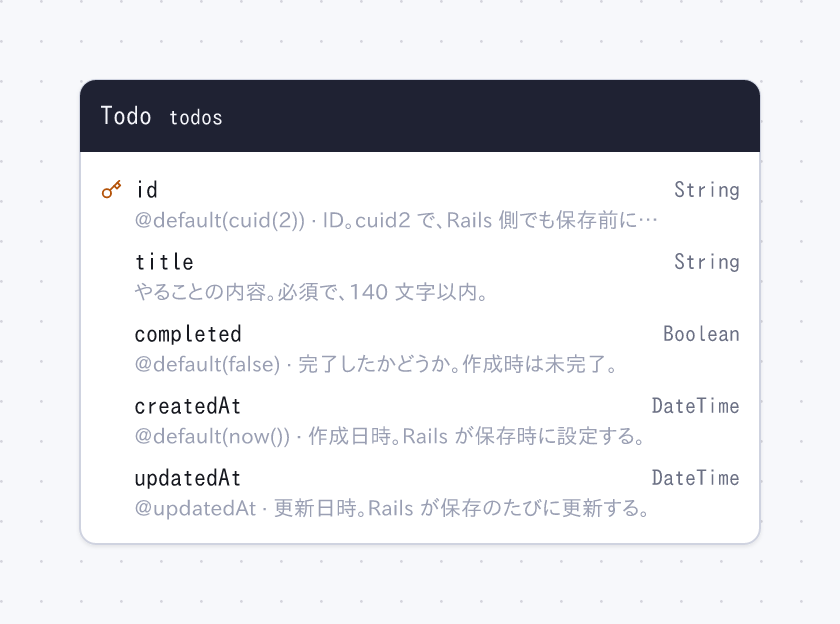

# rails-todo

Rails 8.1 で作った最小限の Todo アプリ。

- DB: SQLite。スキーマは `prisma/schema.prisma` で管理し、[hekireki](https://github.com/nakita628/hekireki) がモデル・バリデーション・その翻訳・ER 図を生成する
- 画面: Hotwire (Turbo)、Tailwind CSS
- 言語: 日本語 (既定) と英語。URL の先頭で切り替わる (`/` と `/ja` は日本語、`/en` は英語)



## 必要なもの

- Ruby 3.4.10 (`mise install`)
- Node.js と pnpm (Prisma と hekireki 用)

## 使い方

```bash
bin/setup      # 依存のインストール、モデル生成、DB 作成、サーバー起動
bin/dev        # サーバー起動 → http://localhost:3000
bin/rails test # テスト
bin/rubocop    # コードスタイルのチェック (rubocop-rails-omakase)
bin/docs       # ドキュメント (YARD) → http://localhost:8808
```

## スキーマの変更

`prisma/schema.prisma` を編集して、次を実行する。

```bash
pnpm db:push   # DB に反映し、モデルと ER 図を作り直す
```

Rails のマイグレーション (`bin/rails db:migrate` など) は使わない。

## 生成物 (git 管理外)

| ファイル | 作るもの |
| --- | --- |
| `app/models/` | hekireki |
| `config/locales/models/` | hekireki |
| `app/assets/builds/tailwind.css` | Tailwind |
| `doc/` | YARD (`bundle exec yard doc`) |
